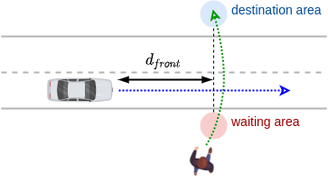
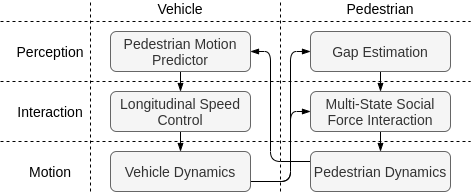
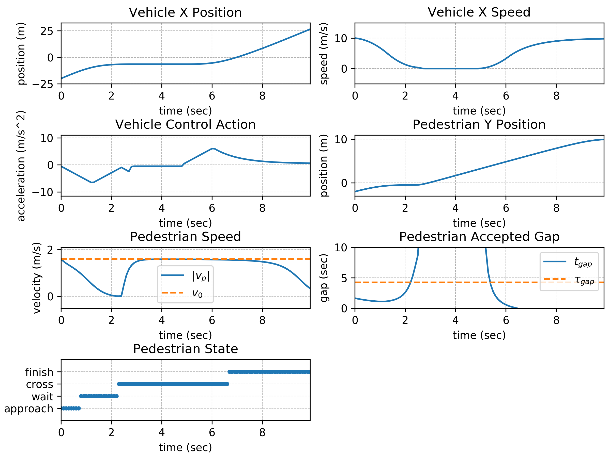

# Vehicle-Pedestrian Interaction (VPI) in Crossing Scenarios
This is the official repository for the following submission in IV2020: A Multi-State Social Force Based Framework for Vehicle-Pedestrian Interaction in Uncontrolled Pedestrian Crossing Scenarios.

Affiliations:
- Control and Intelligent Transportation Research (CITR) Lab
- Department of Electrical and Computer Engineering
- Center for Automotive Research (CAR)

Update Log:
- 2020-05-15: Released with the final submission of IV2020.

## Introduction

Paper Link: [A Multi-State Social Force Based Framework for Vehicle-Pedestrian Interaction in Uncontrolled Pedestrian Crossing Scenarios.](https://arxiv.org/abs/2005.07769)

The framework focuses on uncontrolled pedestrian crossing scenarios:

Below is the structure of the vehicle-pedestrian interaction framework:

Video demostration of two different vehicle control strategies:
- Model predctive control (MPC)
- Obstacle avoidance control (OAC)

<!-- <video width="320" height="240" controls>
  <source src="repo_media/video_sim_mpc.mp4" type="video/mp4">
Your browser does not support the video tag.
</video> -->

Plots of a simulation example using MPC:

State evolution of the above simulation example:

<!-- 
 -->

## Getting Started

Environment Configuration:
- `python3.6+` is required.
- You need to install the packages specified in `requirements.txt` file. You can either use `pip install -r requirements.txt` to automatically install all the required packages or install them manually one by one.

Running the program:
- `simulate.py`: run this script to start a simulation.
  - Before running, in `if __name__ == '__main__':` section, change the configuration:
    - Control Method: you can select from different vehicle control method by specifying `control_method` variable. `mpc` is model predictive control, `oac` is obstacle avoidance control, and `vkc` is velocity keep control. (Details of control strategy see the associated paper.)
  - Initial Vehicle State: change the `init_state` variable. The first component is the longitudinal position, the second component is the longitudinal velocity (which is also the desired speed).
  - This simulation result will be stored as a `.p` file in `results` folder.
- `evaluate.py`: run this script to start evaluation.
  - Before running, you need to change the global variable `data_path` to point to the pickle `.p` file generated by `simulate.py` script.
  - After evaluation, you will find the results in the `results` folder.

## Questions

Feel free to create an issue or shot me an email: Dongfang Yang (yang.3455@osu.edu)
